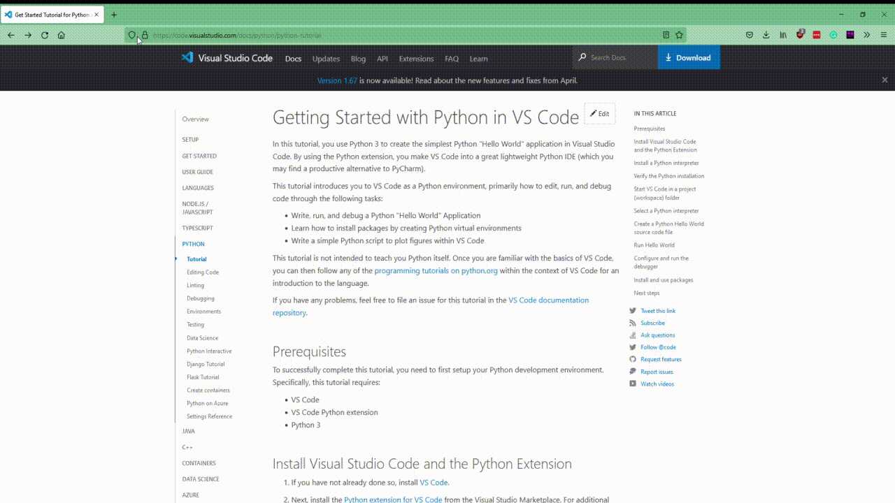

# Dark Night Extension

## Functionality

Firefox extension.
The goal is change all websites to dark mode when enabled.
<br>
This was made to experiment and learn some `javascript`

> **Note** <br>
>
> - If the website has a darkmode feature it will not be enabled. The extention just changes the background color of the html.
> - It does not work on all websites. Only those relatively simple and standard html elements (such as main or content tags). The internet is a messy place.



## Running and Debugging

1. Open FireFox and navigate to:
   ```
   about:debugging
   ```
2. Go to the `This FireFox` tab.
3. Click `Load Temporary Add-on...`
   add any file in the root directory of the extention.

> **Note** <br>
> The extension will be automatically unloaded when firefox is restarted.

### Veiwing Console Outputs

- background script output - Click `inspect` next to the temporary extension in the `about:debugging` page.
- content script output - On a page right click and click `inspect` to view the console.

## Files and Explanations

### `manifest.json`

This file is the meta data that has to do with the extension that is needed by firefox.
<br>
**Contents**

- `'browser_action'` - This specifies that there will be a button in the toolbar of the firefox browser. It will have a default icon as specified by `default_icon` and the tooltip specified by `default_title`.
- `'background'` - This is the list of files that contain the java script that will always
  be running in the background.
- `'content_scripts'` - This will be the javascript that will have access to the website contents (and be able to edit the website contents).
  - `'matches'` - if the url matches one of the specified regex then the content script will be applied.
  - `'js'` - the list of java script that will be used as `content_scripts`

### `background.js`

This is the file containing the javascript that will run in the background. For the most part this will just wait until the button in the toolbar is pressed and it will alert the content scripts of the change. This happens through a message.

### `night.js`

This file will force the website into dark mode (or reset) when it recieves the message from the `background.js` script about the button in the toolbar being pressed.
